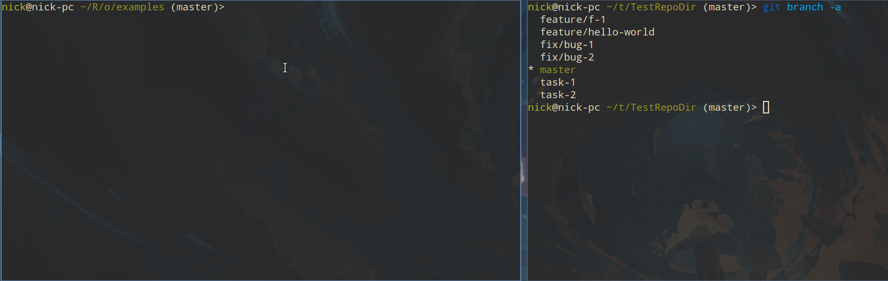

# oscript-fzy

Данная библиотека - реализация алгоритма (https://github.com/jhawthorn/fzy) перенесенная на OneScript.

Позволяет осуществлять нечеткий поиск по коллекциям 1С, таким как Массив, Структура, Соответствие, ТаблицаЗначений. 

## Установка

```cmd
opm install -f .\oscript-fzy-<<текущая версия>>.ospx
```

Подключение:

```bsl
#Использовать oscript-fzy
```

## Описание и примеры

Пример:
```bsl
#Использовать oscript-fzy

Массив = Новый Массив();
Массив.Добавить("app/models/user.rb");
Массив.Добавить("app/models/customer.rc");
Массив.Добавить("app/models/block.rc");

Поиск = Новый Поиск(Массив); // Создание поиска

Результат = Поиск.НайтиЗначенияИлиКлючи("amuser", 1); // Осуществление поиска, и получение результат
```

Функция "НайтиЗначенияИлиКлючи" имеет следующие параметры:

- Значение,  которое будем искать. Тип Строка.
- Количество (по умолчанию 0). Отвечает за возвращаемый результат. Если задать 0, будет возвращен массив со всеми совпадениями. Если 1, то будет возвращено самое близкое значение. Если число больше 1, будет возвращен массив указанного размера, если результатов совпадений больше. Тип Число;
- Ключи (по умолчанию Ложь). Если истина, возвращаются не значения, а ключи соответствующие первоначальной коллекции. Тип Булево. 

Тип возвращаемых ключей по коллекциям

| Коллекция        | Возвращаемый ключ       |
| -                | -                       |
| Массив           | Индекс элемента         |
| Структура        | Ключ                    |
| Соответствие     | Ключ                    |
| Таблица значений | Строка таблицы значений |

Процедура "ЗагрузитьДанные" Имеет следующие параметры

- Данные. Источник для выполнения поиска. Типы: Массив, Структура, Соответствие, Таблица значений.
- КолонкиИсточник. Необязательный. При загрузке таблицы значений, можно через запятую указать колонки, по которым осуществлять поиск. Тип Строка.

## Интерактивный поиск в консоли

Дополнительно есть класс для выполнения интерактивного поиска. 

```bsl
#Использовать oscript-fzy

Поиск = Новый Поиск();
Поиск.ЗагрузитьДанные(Массив);
ИнтерактивныйПоиск = Новый ИнтерактивныйПоиск(Поиск);
РезультатЗначение = ИнтерактивныйПоиск.НачатьВыбор();
```

В конструктор которого нужно передать объект "поиск" с подготовленными данными.

Главная функция "НачатьВыбор", имеет два параметра:

- Ключи(Тип булево), который влияет на возвращаемые значения так же как в НайтиЗначенияИлиКлючи. Возвращаемое значение всегда одно.
- ТекстПодсказки(Тип строка), выведет текст, подсказывающий пользователю, что нужно искать.


Управление:

| Кнопка         | Действие                                 |
| -              | -                                        |
| ESC            | Отмена выбора. Вернет неопределено       |
| Tab            | Переключить на поиск в найденном         |
| Enter          | Выбор текущего элемента                  |
| Стрелка вверх  | Курсор вверх                             |
| Стрелка вниз   | Курсор вниз                              |
| Стрелка влево  | Курсор в самый верх(последний элемент)   |
| Стрелка вправо | Курсор в самый низ(первый элемент)       |
| Любая другая   | В режиме выбора переходит в режим ввода. |

Интерактивный поиск работает в двух режимах.

- Первый это ввод значений для поиска.
- Второй выбор варианта, переключения режима поиска.

На данный момент при прокрутке большего списка в интерактивном режиме может быть мерцание, разной степени бесячести. Это из-за полной отрисовки экрана. Это поправлю в будущем, если это кому-то будет нужно.

Этот метод можно применять например для:

- Интерактивного переключения веток репозитория из скрипта

```bsl
#Использовать oscript-fzy
#Использовать gitrunner

ГитРепозиторий = Новый ГитРепозиторий();
ГитРепозиторий.УстановитьРабочийКаталог("/home/nick/tmp/TestRepoDir");
ТЗВеток = ГитРепозиторий.ПолучитьСписокВеток();

Поиск = Новый Поиск(ТЗВеток, "Имя");
ИнтерактивныйПоиск = Новый ИнтерактивныйПоиск(Поиск, "Начните ввод имени ветки");
ВыбранноеЗначение = ИнтерактивныйПоиск.НачатьВыбор(Истина);

ГитРепозиторий.ПерейтиВВетку(ВыбранноеЗначение.Имя);
Сообщить("Переключились на ветку " + ВыбранноеЗначение.Имя);

```



- Выбор файлов для скачивания с интернета

```bsl
#Использовать oscript-fzy
#Использовать 1connector

// допустим хочу прочитать из интеренета страницу, выбрать нужный файл и скачать
// смотреть будем эту страницу http://mirror.corbina.net/debian/

Урл = "http://mirror.corbina.net/debian/";

Результат = КоннекторHTTP.Get(Урл).Текст();

СсылкиДляСкачивания = Новый Соответствие();

Для каждого ТекСтрока Из СтрРазделить(Результат, Символы.ПС) Цикл
	Если СтрНачинаетсяС(ТекСтрока, "<a href=") Тогда
		ЧастиСсылки = СтрРазделить(ТекСтрока, """");
		Если не СтрЗаканчиваетсяНа(ЧастиСсылки[1], "/") Тогда
			СсылкиДляСкачивания.Вставить(Урл+ЧастиСсылки[1], Сред(СтрРазделить(ЧастиСсылки[2],"<")[0],2));
		КонецЕсли
	КонецЕсли;
КонецЦикла;

Поиск = Новый Поиск(СсылкиДляСкачивания);
ИнтерактивныйПоиск = Новый ИнтерактивныйПоиск(Поиск, "Начните ввод имени файла");
ВыбранноеЗначение = ИнтерактивныйПоиск.НачатьВыбор(Истина);

// Представим, что мы тут качаем файл.
Сообщить(СтрШаблон("Выбран файл для скачивания %1", ВыбранноеЗначение));

```


- Поиск и выбор файлов на диске
- И многие другие варианты выбора.

Подробно смотрите примеры и тесты.

В дальнейшем наполню всевозможными примерами применения, которые будут приходить в голову.
